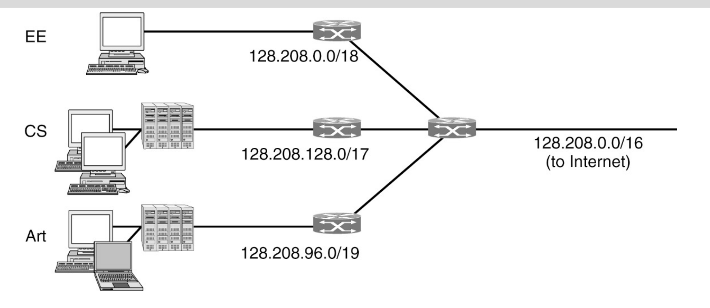
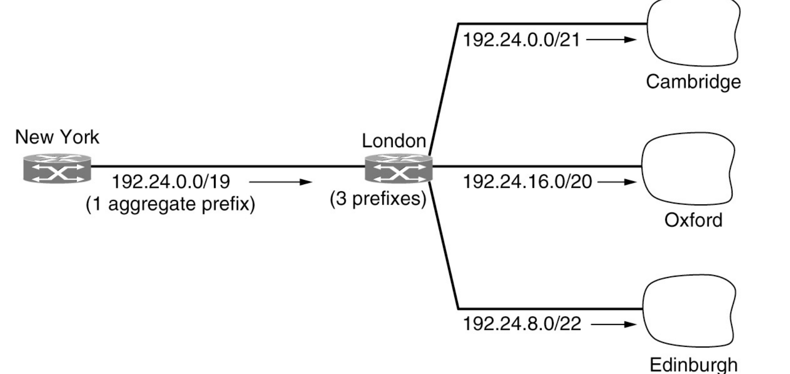

# Network Layer

<!-- markdown-toc start - Don't edit this section. Run M-x markdown-toc-refresh-toc -->
**Table of Contents**

- [Network Layer](#network-layer)
    - [10 Principals](#10-principals)
    - [Components of Network Layer](#components-of-network-layer)
    - [The Network Layer in the internet](#the-network-layer-in-the-internet)
    - [Types of networks](#types-of-networks)
    - [Prefix and a Subnet Mask](#prefix-and-a-subnet-mask)
    - [Subnets](#subnets)
    - [Classless Interdomain Routing (CIDR)[#network]() [#cidr]()](#classless-interdomain-routing-cidrnetwork-cidr)
    - [References](#references)

<!-- markdown-toc end -->

## 10 Principals

1. Make sure it works
2. Keep it simple
3. Make clear choices
4. Exploit modularity
5. Expect heterogeneity
6. Avoid static options with parameters
7. Look for a good design; it need not be perfect
8. Be strict when sending and tolerant when receiving
9. Think about scalability
10. Consider performance and cost

## Components of Network Layer
1. IP Version 4 Protocol
2. IP Addresses
3. IP Version 6 Protocol
4. Internet control Protocols
5. Label switching and MPLS

## The Network Layer in the internet


## Types of networks
* Subnets
* Prefixes
  * A contiguous block of IP address space
* CIDR
  * Classless interDomain Routing
* Classful and special addressing
* NAT
  * Network Address Translation

## Prefix and a Subnet Mask

```
                                32 bits
            <------------------------------------------------>
                        L bits                   32 - L bits
            <---------------------------------><------------->
             -------------------------------------------------
            |             Network             |      Host     |
             -------------------------------------------------
Subnet mask  111111111111111111111111111111111 0 0 0 0 0 0 0 0
```
    * Both prefixes and subnet masks are used to defining the boundaries of a network.
      * Important for routing traffic and ensuring that packets are delivered to their intended desintations.

e.g. Prefix is 24 and subnet mask is a 32-bit value.
    * Subnet mask is set to 1.
    * 1 bits represent network portion
    * 0 bits represent the host portion
    * 255.255.255.0

## Subnets
 

* Divide a network into two or more networks.
* Divide the host identifier portion of an IP address into two or more parts using a subnet mask.

* e.g. Sub netting address range of 192.168.1.0 - 192.168.1.255 into 4 smaller subnets.
    * Subnet mask is 255.255.255.192
    * CIDR Notation is /26
    * 192 is chosen because it allows us to create 4 subnets with 64 values each.
    * First Subnet
        * 255.255.255.192 bitwise AND 192.168.1.0 = 192.168.1.0
    * Second Subnet
        * 192.168.1.0 Bitwise OR 0.0.0.63
        
```
00000000
AND
11000000
=
00000000
```

```
00000000
AND
    11000000
=
00000000
```

## Classless Interdomain Routing (CIDR)[#network]() [#cidr]()
* Method for allocating IP addresses and routing traffic.
* Slow the growth of routing tables on routers across the internet and help slow the rapid exhaustion of IPv4 addresses.
* Uses suffix to represent number of bits in the network prefix.
* Uses variable length IP prefixing
  * Allows more efficient use IP addresses
  * Flexible allocation of IP address blocks.
  
* A set of IP Address Assignments
 

* Aggregation of IP prefixes
 

* Longest matching prefix routing at the New York router.
 

### CIDR Notation

e.g. /19 means first 19 bits of IP address is used to represent the network and remaining bits is used to identify the host.

## CIDR vs Subnet
* Generally mean the same thing
* CIDR is referred at ISP level
* Subnet is referred to at organizational level.


## References
[CIDR](https://en.wikipedia.org/wiki/Classless_Inter-Domain_Routing) 
